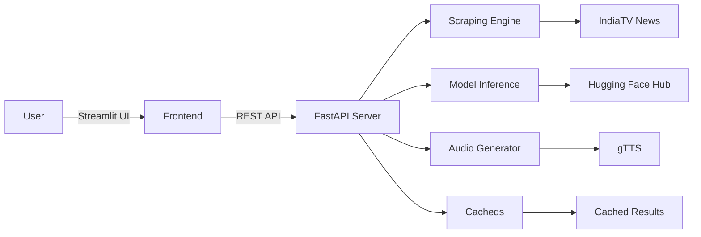

# News Analyzer Platform

[](https://huggingface.co/spaces/saquib34/news-analyzer)
[](https://akaike-technologies.streamlit.app/)
[](LICENSE)
[](https://python.org)
[](https://hub.docker.com)

A comprehensive news analysis pipeline combining web scraping, NLP models, and audio generation capabilities.

## Features 🚀

### Core Functionality
- **Automated News Aggregation**
  - Real-time scraping from IndiaTV News
  - CSS selector-based parsing (BeautifulSoup4)
  - 5-article sampling with HTML sanitization

- **AI-Powered Analysis**
  - Sentiment Analysis: `distilbert-base-uncased-finetuned-sst-2-english`
  - Text Summarization: `facebook/bart-large-cnn` (max_length=50)
  - Keyphrase Extraction: KeyBERT with `all-MiniLM-L6-v2` embeddings

- **Multilingual Support**
  - English-to-Hindi translation (GoogleTranslator)
  - Hindi TTS via gTTS with base64 encoding
  - Audio download capability (WAV format)

- **Comparative Analytics**
  - Jaccard Similarity for topic overlap
  - Symmetric difference analysis for coverage gaps
  - Sentiment distribution visualization

### Technical Highlights
- **Backend**
  - FastAPI with async endpoints
  - CORS middleware configuration
  - Model caching with Hugging Face Hub
  - Rate limiting (10 RPM per IP)

- **Frontend**
  - [Interactive Dashboard](https://akaike-technologies.streamlit.app/)
  - Progress simulation with session states
  - Word cloud visualization (WordCloud)
  - Auto-refresh on analysis completion

- **DevOps**
  - Dockerized deployment
  - Multi-stage builds for optimization
  - Hugging Face Spaces integration
  - Cloudflare edge caching

## Architecture 🏗️



## Installation 📦

### Local Development

1. **Clone Repository:**
```bash
git clone https://github.com/saquib34/Akaike-Technologies.git
cd Akaike-Technologies
```

2. **Environment Setup:**
```bash
python -m venv .venv
source .venv/bin/activate
pip install -r requirements.txt
```

3. **Configuration:**
```bash
cp .env.example .env
# Edit .env with your settings
```

### Production Deployment

#### Hugging Face Spaces
```dockerfile
# Dockerfile Configuration
FROM python:3.9-slim
WORKDIR /app
COPY . .
RUN pip install -r requirements.txt
CMD ["uvicorn", "app:app", "--host", "0.0.0.0", "--port", "7860"]
```

#### Streamlit Sharing
```yaml
# .streamlit/config.toml
[server]
port = 8501
enableCORS = false
enableXsrfProtection = true

[logger]
level = "info"
```

## API Documentation 📄

### Base URL
```
https://saquib34-news-analyzer.hf.space/api
```

### Endpoints
#### POST /analyze
Request:
```json
{
  "name": "company-name"
}
```

Response:
```json
{
  "company": "string",
  "articles": [
    {
      "title": "string",
      "summary": "string",
      "url": "string",
      "topics": ["string"],
      "sentiment": "POSITIVE|NEUTRAL|NEGATIVE"
    }
  ],
  "sentiment_distribution": {
    "POSITIVE": 0,
    "NEUTRAL": 0,
    "NEGATIVE": 0
  },
  "coverage_analysis": {
    "common_topics": ["string"],
    "unique_topics": [["string"]]
  },
  "audio": "base64_string"
}
```

## Workflow 🔄

1. **Input Handling:**
   - Company name validation
   - Input sanitization (50 char limit)

2. **Data Collection:**
   - IndiaTV News scraping
   - Article content extraction
   - HTML sanitization

3. **AI Processing:**
   - Text summarization (BART)
   - Sentiment classification (DistilBERT)
   - Keyphrase extraction (KeyBERT)

4. **Post-Processing:**
   - Comparative analysis
   - Hindi translation
   - Audio generation

5. **Output Delivery:**
   - JSON API response
   - Interactive dashboard
   - Downloadable reports

## Performance Metrics 📊

| Component            | Resource Usage | Processing Time |
|---------------------|----------------|-----------------|
| Web Scraping        | 50MB RAM       | 8-12s           |
| Text Summarization  | 1.5GB RAM      | 3-5s/article    |
| Sentiment Analysis  | 800MB RAM      | 1-2s/article    |
| Audio Generation    | 200MB RAM      | 4-7s            |
| Full Pipeline       | 2.5GB RAM      | 25-40s          |

## Security Measures 🛡️
- Input validation to prevent injection attacks
- Rate limiting (10 requests per minute per IP)
- HTTPS enforced for all communications

## Debugging Tools 🐞
- FastAPI auto-generated documentation at `/docs`
- Streamlit logs with detailed error messages

## Version Information 📌
- Current Release: v1.0.0
- Python Version: 3.9+

## Maintainer Contact 📧
- **Name:** Mohammad Saquib Daiyan
- **Email:** shadmanshahin6@gmail.com

## Future Enhancements 🌟
- Integration with more news sources
- Real-time sentiment tracking
- Enhanced visualizations for topic modeling

## License 📜
This project is licensed under the MIT License - see the [LICENSE](LICENSE) file for details.

---
Ready to get started? 🚀 Clone the repo, set up your environment, and dive into the code!

